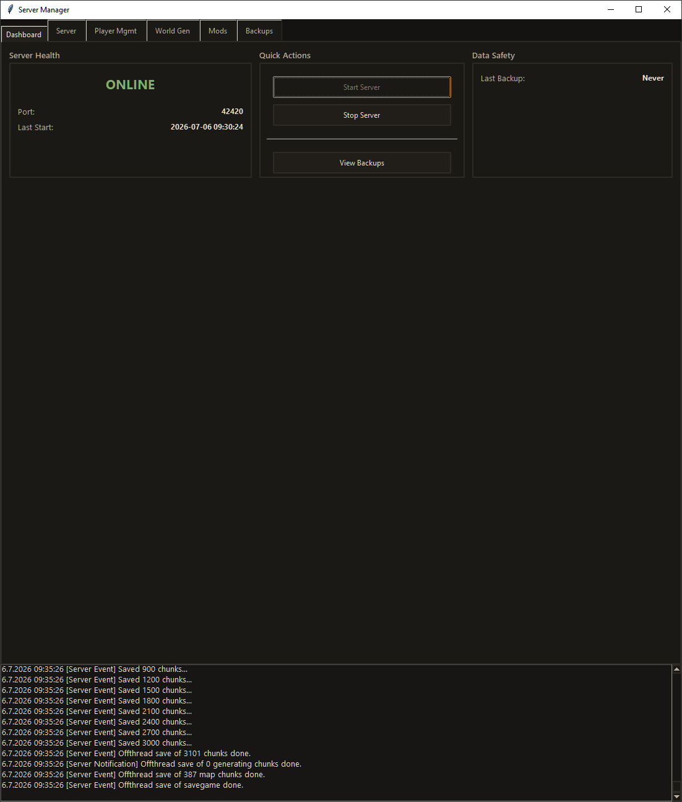
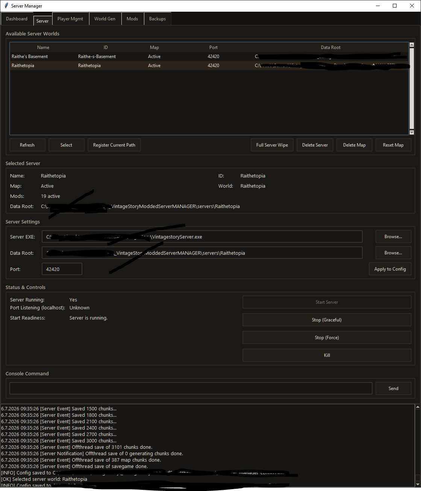
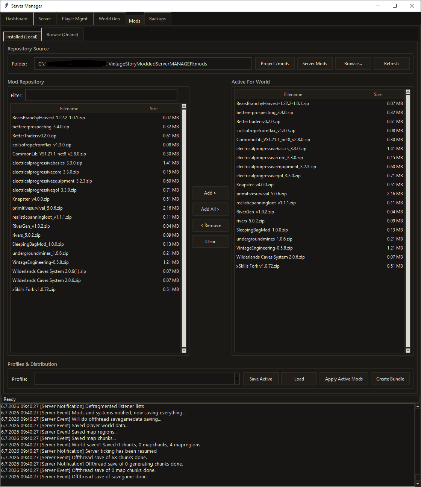

# Vintage Story Server Manager (Prototype 2)

A custom Python/Tkinter orchestration tool for managing local Vintage Story dedicated servers — world generation, mods, players, and backups, all from one dark-themed desktop app.

## 📸 Screenshots

### Dashboard
At-a-glance server health with a live **ONLINE/OFFLINE** indicator, port and last-start details, one-click Start/Stop/Backup, and a streaming console of live server events.

### Server Management
Manage every generated world from a single table — select, register, wipe, delete, or reset maps. Configure the server executable, data root, and port, then control the process with graceful stop, force stop, kill, and a live console command bar.

### Mod Management
A two-pane workflow: browse your local mod repository on the left, curate the world's active mod set on the right. Add, remove, and clear mods, save reusable profiles, apply them to a server, and bundle client mods for distribution — with an online browser for discovering new mods.

## 🚀 Features (Prototype 2)

### 🕹️ Dashboard
- **Live Status**: Real-time server online/offline indicator.
- **Quick Actions**: One-click Start, Stop, and Backup.
- **Health Metrics**: Port monitoring and uptime tracking.

### 🌍 World Generation
- **Granular Control**: Sliders for Sea Level and Geologic Upheaval.
- **Dimensions**: Configurable World Width/Height.
- **Seed Management**: Random or custom seeds.
- **Mod Config**: JSON injection for advanced world-gen mods.

### 📦 Mod Management
- **Local Library**: Scans and lists installed mods (.zip/.dll).
- **Profiles**: Create and save mod Loadouts (e.g., "Vanilla+", "Hardcore").
- **Distribution**: One-click bundling to zip mods for client players.

### 👥 Player Administration
- **Live List**: View online players and session duration.
- **Moderation**: Kick, Ban, and Whitelist management.
- **Permissions**: Grant/Revoke Operator (Admin) status.

### 🛡️ Data Vault (Backups)
- **Automated Scheduling**: Configurable interval backups (e.g., every 60 mins).
- **Retention Policy**: Auto-deletes old backups after X days.
- **Safety Restore**: Point-in-time restore that auto-archives current data before overwriting.

## 🛠️ Usage

1. **Configure**: On first launch, go to the **Server** tab and set your `server_exe_path` and `data_path`.
2. **Launch**: Run `start.bat`.

## 📂 Project Structure
- `orchestration_core`: Central logic controller and state management.
- `server_manager_core`: Backend logic (Process, Backups, Mods).
- `ui_core`: Tkinter frontend and themes.
